# OctopusDeploy Jenkins Plugin Developer Guide
This is a getting started guide for a developer who would like to contribute to the plugin, fix a bug, make an improvement, contributions from the community are welcome.

## Introduction
The following guide will briefly outline how to get started using an Ubuntu based OS, or using a recent version of Microsoft Windows

This project is in the process of being migrated over to the Gradle build system, in the interim this guide will contain instructions for development using either Maven *or* Gradle

## Fundamentals
The Jenkins Octopus plugin currently requires **Java 8** and a locally installed version of **Octo CLI**

## Environment Setup
### Ubuntu
1. Install Java
> sudo apt install openjdk-8-jdk
2. Install dotnet
>  sudo snap install dotnet-sdk
3. Install Octo CLI
> dotnet tool install Octopus.DotNet.Cli --global

### Windows
1. Download [OpenJDK 8 LTS](https://adoptopenjdk.net/) and install to a location of your choosing
2. Set the `JAVA_HOME` environment variable to the root directory of the JDK installation
3. Ensure `%JAVA_HOME%\bin` is added to your path
4. [Download](https://dotnet.microsoft.com/download) and install the latest dotnet
5. Install Octo CLI
> dotnet tool install Octopus.DotNet.Cli --global

# Build and run the plugin locally
Clone this repository locally with Git:
> git clone https://github.com/OctopusDeploy/octopus-jenkins-plugin

## Configure using Maven and IntelliJ
1. Open the project in IntelliJ
2. With the project selected in the project nav hit `F4`, select `Java 1.8`
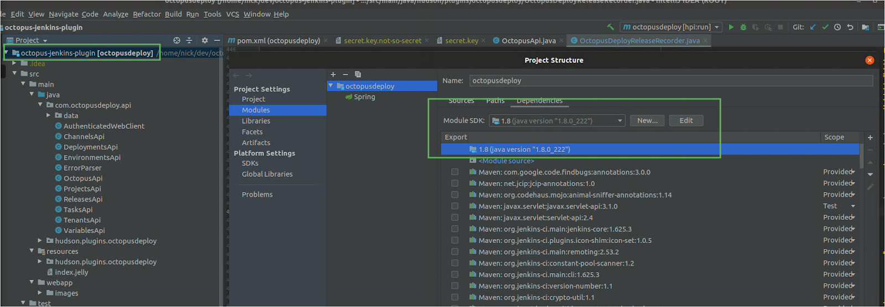
3. Create a maven run configuration
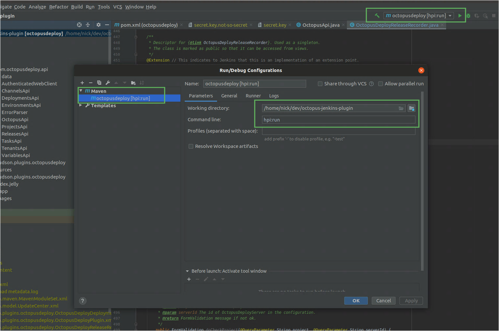
4. Under runner, ensure the Java version is right, and the path is specified
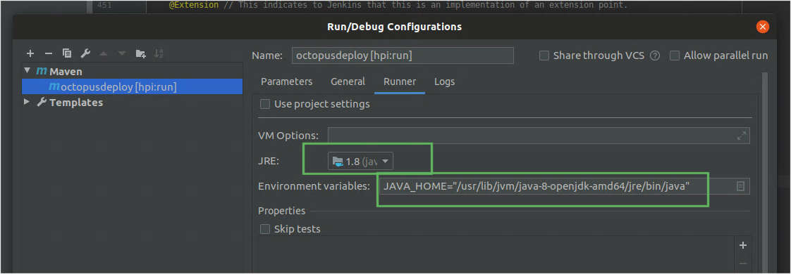
5. You can now run the project, it will fetch dependencies and then sit at “run”, there will be errors and warnings, they don’t mean it’s not running

6. You can then navigate to localhost:8080, you can follow the link to `jenkins`
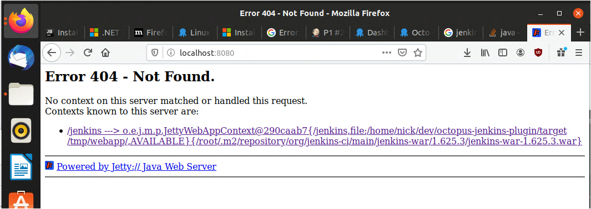
7. From then on for this run you can go to `localhost:8080/jenkins`
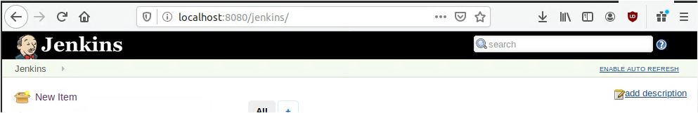

## Configure using Gradle and IntelliJ
1. Import project into Intellij as a Gradle project
2. Ensure the correct Java version is set
3. Run the `server` task from the Gradle panel or via the command line
> ./gradlew server
5. Once the server has been run once a *Run/Debug* configuration will be automatically added, or you can configure it manually.
6. Once running the Jenkins instance will be available at `http://127.0.0.1:8080` by default


# Running Tests
To execute tests from the command line, execute:

## With Maven
**Unit tests**
> mvn test

## With Gradle
**Unit tests**
> ./gradlew test

**Integration tests**
> ./gradlew integrationTest

*Note:* Integration tests rely on a running Octopus Deploy instance, behaviour for running/using a server is controlled with the following environment variables:
- `OCTOPUS_SDK_AT_USE_EXISTING_SERVER` - "true" or "false" value that decides between an existing server or a clean dockerised version
- `OCTOPUS_SERVER_URL` - Configure the URL of an existing server
- `OCTOPUS_SERVER_API_KEY` - API key for an existing server
- `OCTOPUS_LICENSE` - XML License string, required as all tests are confined to unique spaces 

## End-to-end tests
End-to-end test coverage is currently provided by `E2eTest.java`.
To avoid adding further dependencies to `pom.xml` as this project is being converted to Gradle, `E2eTest.java` compilation and execution is disabled when running from Maven.

Due to limitations and behaviours of the Jenkins Test Harness, please note the following:
- e2e tests are run under JUnit-4
- e2e test class must be located under `src/test/java`
- The installation path of OctoCLI must be provided via environment variable `OCTOPUS_CLI_PATH`
- Other required environment variables as per [With Gradle - Integration Tests](#with-gradle)

# Releasing a new version
## Deploying the Jenkins plugin
Jenkins provides hosting for plugins in an artifactory repository: https://repo.jenkins-ci.org/. Jenkins also provides a GitHub repository and CI, but we have elected to use our own GitHub and CI.

The Octopus plugin inherits the Jenkins Plugin POM file (https://github.com/jenkinsci/plugin-pom) that includes configuration required to build and deploy the plugin. Build and deploy can be performed by running the command:

> mvn release:prepare release:perform

`release:prepare` updates the version information in the pom.xml file, commits it to source control and then tags that commit.

`release:perform` builds the required artifacts and uploads them to the Jenkins plugin repository.

## Octopus Specific
Note: this is only for Octopus Staff on how we release the plugin. Team city houses some of the credentials required to complete the process.

### Setup
1. Create the next milestone
1. Create an Issue - For any bug fixes or enhancements
1. You can create the Github "Release" after it has been tagged as part of the deployment process below:

### Deployment
Our deployment process for this plugin is evolving. The choice to use Team City in this case is that is our tool of choice for deploying Octopus and other plugins, this gives us consistency within Octopus.

Currently go to the Octopus Team City instance and navigate to: `Build Integration / Jenkins Plugin` select the `Release to public Jenkins artifactory` project.

Select `Run` and fill in the new version in the dialog:

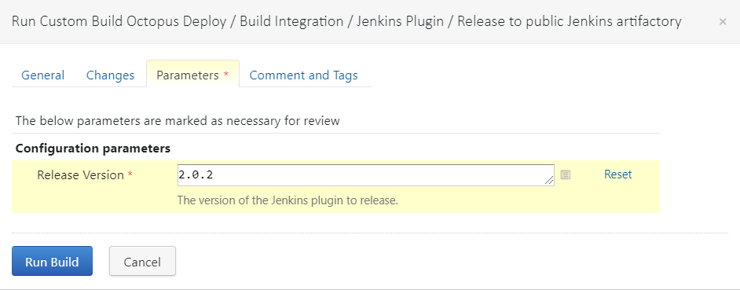

**Please note**: Before triggering the build you need to ensure that
1. The commit isn't tagged with the version
1. The version number in the `<version>` tag in [pom.xml](https://github.com/OctopusDeploy/octopus-jenkins-plugin/blob/master/pom.xml) is suffixed with `-SNAPSHOT`.
1. If the Teamcity build fails, it might have already committed changes to the git repository, you will need to manually revert changes before trying again.

### Managing the version number
For most changes the version number is self-managed by the build process. If you need to bump the version number manually, such as bumping the major version number, you will need to update the version number in the `<version>` tag in [pom.xml](https://github.com/OctopusDeploy/octopus-jenkins-plugin/blob/master/pom.xml). The version number format should be a 3  `major.minor.patch-SNAPSHOT`. The `-SNAPSHOT` suffix is required.

**Please note**: The [plugin repository](https://plugins.jenkins.io/) can take several days before the new version shows on the [download page](https://plugins.jenkins.io/octopusdeploy/). Be patient.

# Inside Jenkins
## Configure Octo CLI
In the Jenkins version set at the minimum for the plugin, the CLI configuration is found under
> Manage Jenkins > Global Tool Configuration

If you are testing on an older version of Jenkins (earlier in the code base), it used to be under  *Configure System*


# Plugin Concepts
## Validation
The various build steps offered by the plugin support validation, warnings and errors. These are merely a visual distinction, yellow vs red. Neither will prevent the form/page from being saved.

## Convention Based
The way fields are validated is convention based. From the corresponding Jelly file, which defines the HTML layout of the controls. Obtain the field name and create a method in the class that extends AbstractOctopusDeployDescriptorImpl

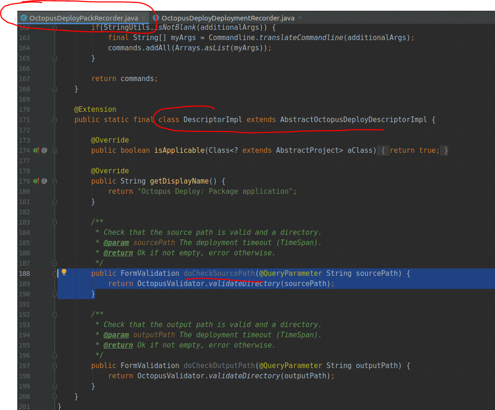


## Help Text
Are separate files, that are named by convention (help-field.html) in order for the blue question mark to show up.

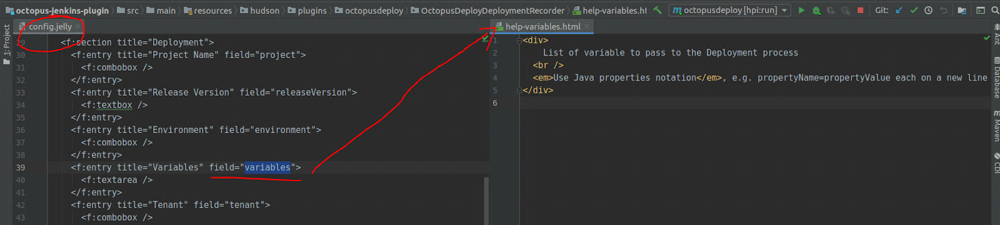

## Exceptions
It appears that the common / supported approach in Jenkins and the plugins is to throw the `IllegalStateException` exception at build time, which gives an ugly stack trace for what is an already known issue.

Having looked around Stack Overflow, forums and within the code bases of other plugins this doesn’t bother them and is how they all do it.
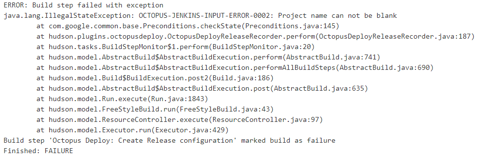


# Plugin Usages
## Setting up a local SVN repository
https://tecadmin.net/install-subversion-server-on-ubuntu/
Note that the package libapache2-svn has been replaced by libapache2-mod-svn in recent versions of Ubuntu

Make a new project in SVN, check it out in the current directory and then commit the contents:

```
svn mkdir http://localhost/svn/myrepo/hello_world
svn co http://localhost/svn/myrepo/hello_world
svn add hello_world.txt
svn ci
```

## Add SVN to jenkins project
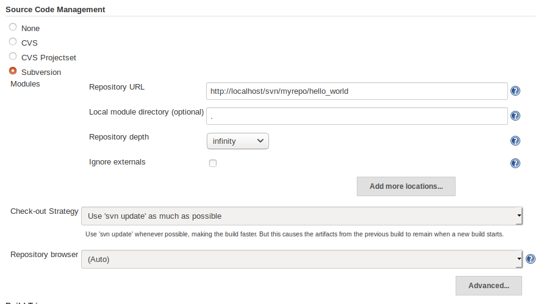

## Build script to clean packages in workspace
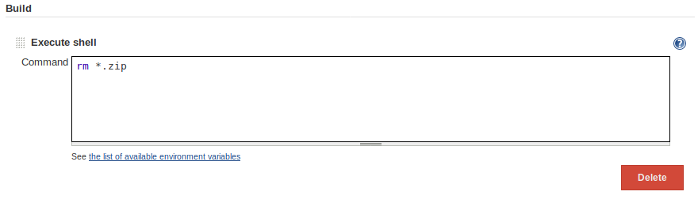


## Package application step
Packages hello_world.txt
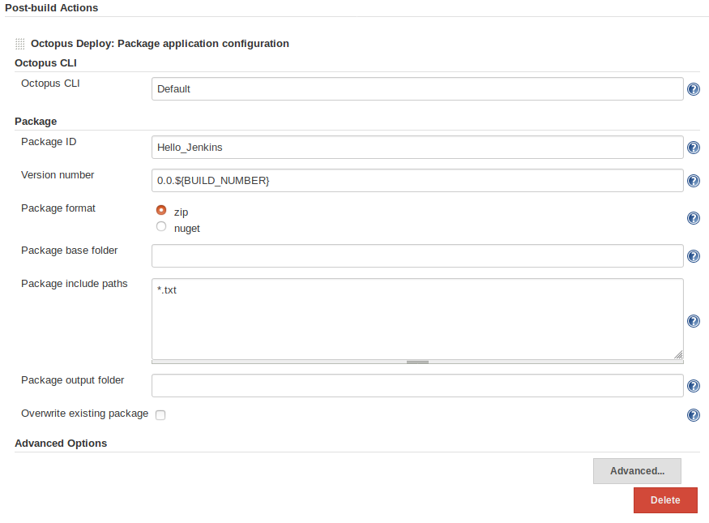

## Push package
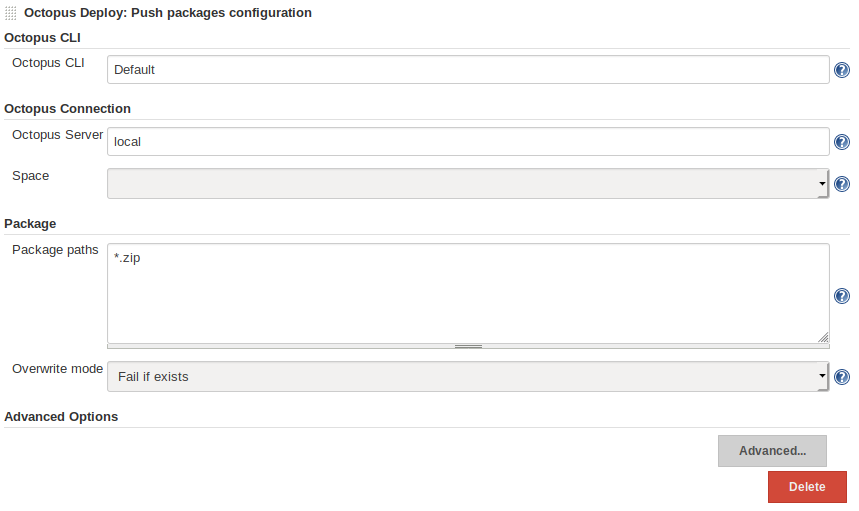

## Handy Links to Blogs / Documentation
 - https://jenkins.io/doc/developer/architecture/
 - https://wiki.jenkins.io/display/JENKINS/Basic+guide+to+Jelly+usage+in+Jenkins
 - https://wiki.jenkins.io/display/JENKINS/Extend+Jenkins
 - https://wiki.jenkins.io/display/JENKINS/Form+Validation
 - https://medium.com/velotio-perspectives/tutorial-developing-complex-plugins-for-jenkins-a34c0f979ca4
 - https://medium.com/faun/net-core-projects-ci-cd-with-jenkins-ubuntu-and-nginx-642aa9d272c9


## Troubleshooting
> Have you bricked / corrupted your Jenkins dev environment?
> An option is to blow away the currently set up environment by navigating to the `work` at the root of the cloned git repository


## Using Docker
Some docker files have been provided to assist development for users who may not have all the prerequisite tooling available on their local machine for development. This process may currently be slower and does not provide the benefits of debugging at this point in time.
1. Run `docker-compose up -d` to build the Octopus plugin and allow the Jenkins server to start. This first time this runs it will take a LONG time to run as it will download all the dependencies and store them in the mounted directory. The subsequent runs will be much quicker since only the compilation process will need to run.
2. Once the server has started navigate to the instance via `http://localhost:8080/jenkins`.
3. Configure your Octopus Serer instance by navigating to `Manage Jenkins` -> `Configure System`.  If testing your local Octopus instance on the docker host you can use the domain `host.docker.internal` to access the host from inside your container.
4. The Octopus cli tool is BYO with jenkins, so find the latest available linux build and add to the `docker_data/jenkins/octocli` directory. This directory will be mounted into the container.
   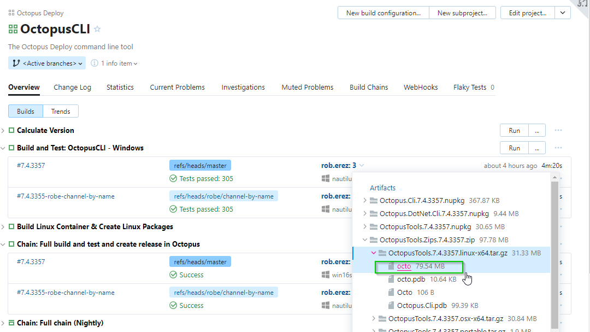
5. Configure the cli tool via `Manage Jenkins` -> `Global Tool Configuration` and provide the `/octocli/octo` path.
6. Create and test your builds!
