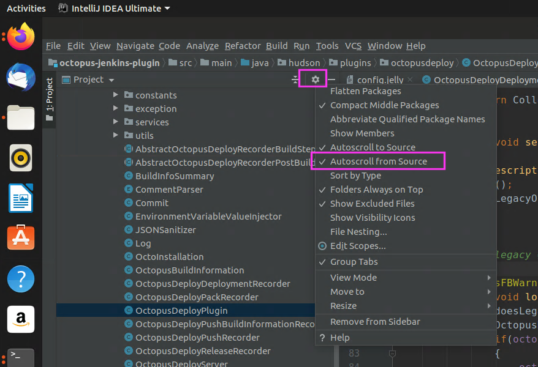

# OctopusDeploy Jenkins Plugin Developer Guide #
This is a getting started guide for a developer who would like to contribute to the plugin, fix a bug, make an improvement, contributions from the community are welcome.

## Introduction ##
The simplest way to get up and running is on a Linux OS, e.g. Ubuntu install some fundamental tools and applications and using IntelliJ spin up the repository.


# Fundamentals #
## Java 8 ##

Currently the plugin is set to run on Java 8

> sudo apt install openjdk-8-jdk

## IntelliJ ##

Download the Linux .tar.gz bundle from
> JetBrains - https://www.jetbrains.com/idea/download/#section=linux

Extract and run the toolbox, or use the snap package
> sudo snap install intellij-idea-ultimate --classic

## Install Octo CLI ##
This is what the plugin uses to communicate with Octopus Deploy

If you don’t have dotnet installed you can do:

>  sudo snap install dotnet-sdk

You can install the Octopus.DotNetCli with:

> dotnet tool install Octopus.DotNet.Cli --global

# Running the Plugin #

The code is at, clone this repository locally with [Git](https://help.ubuntu.com/lts/serverguide/git.html):

> https://github.com/OctopusDeploy/octopus-jenkins-plugin

## Configure IntelliJ Project ##

After cloning the repository open in in IntelliJ, there's some configuration required the first time before you can run it.

1. Open the project in IntelliJ
2. With the project selected in the project nav hit `F4`, select `Java 1.8`


3. Create a maven run configuration


4. Under runner, ensure the Java version is right, and the path is specified


5. You can now run the project, it will fetch dependencies and then sit at “run”, there will be errors and warnings, they don’t mean it’s not running


6. You can then navigate to localhost:8080, you can follow the link to `jenkins`


7. From then on for this run you can go to `localhost:8080/jenkins`


## IntelliJ Tips ##

Select Autoscroll from Source, to help you see where files are as you navigate search




# Releasing a new version #

## Deploying the Jenkins plugin ##

Jenkins provides hosting for plugins in an artifactory repository: https://repo.jenkins-ci.org/. Jenkins also provides a GitHub repository and CI, but we have elected to use our own GitHub and CI.

The Octopus plugin inherits the Jenkins Plugin POM file (https://github.com/jenkinsci/plugin-pom) that includes all of the configuration required to build and deploy the plugin. Build and deploy can be performed by running the command:

> mvn release:prepare release:perform

`release:prepare` updates the version information in the pom.xml file, commits it to source control and then tags that commit.

`release:perform` builds the required artifacts and uploads them to the Jenkins plugin repository.

## Octopus Specific ##
Note: this is only for Octopus Staff on how we release the plugin. Team city houses some of the credentials required to complete the process.

### Setup ###
1. Create the next milestone
1. Create an Issue - For any bug fixes or enhancements
1. You can create the github "Release" after it has been tagged as part of the deployment process below:

### Deployment ###
Our deployment process for this plugin is evolving. The choice to use Team City in this case is that is our tool of choice for deploying Octopus and other plugins, this gives us consistency within Octopus.

Currently go to the Octopus Team City instance and navigate to: `Build Integration / Jenkins Plugin` select the `Release to public Jenkins artifactory` project.

Select `Run` and fill in the new version in the dialog:


### Managing the version number
For most changes the version number is self-managed by the build process. If you need to bump the version number manually, such as bumping the major version number, you will need to update the version number in the `<version>` tag in [pom.xml](https://github.com/OctopusDeploy/octopus-jenkins-plugin/blob/master/pom.xml). The version number format should be a 3  `major.minor.patch-SNAPSHOT`. The `-SNAPSHOT` suffix is required.

**Please note**: The [plugin repository](https://plugins.jenkins.io/) can take several days before the new version shows on the [download page](https://plugins.jenkins.io/octopusdeploy/). Be patient.

# Inside Jenkins #

## Configure Octo CLI ##
In the Jenkins version set at the minimum for the plugin, the CLI configuration is found under

> Manage Jenkins > Global Tool Configuration

If you are testing on an older version of Jenkins (earlier in the code base), it used to be under  *Configure System*


# Plugin Concepts #

## Validation ##

The various build steps offered by the plugin support validation, warnings and errors. These are merely a visual distinction, yellow vs red. Neither will prevent the form/page from being saved.

## Convention Based ##

The way fields are validated is convention based. From the corresponding Jelly file, which defines the HTML layout of the controls. Obtain the field name and create a method in the class that extends AbstractOctopusDeployDescriptorImpl


## Help Text ##
Are separate files, that are named by convention (help-field.html) in order for the blue question mark to show up.


## Exceptions ##

It appears that the common / supported approach in Jenkins and the plugins is to throw the `IllegalStateException` exception at build time, which gives an ugly stack trace for what is an already known issue.

Having looked around Stack Overflow, forums and within the code bases of other plugins this doesn’t bother them and is how they all do it.


# Plugin Usages #

## Setting up a local SVN repository  ##
https://tecadmin.net/install-subversion-server-on-ubuntu/
Note that the package libapache2-svn has been replaced by libapache2-mod-svn in recent versions of Ubuntu

Make a new project in SVN, check it out in the current directory and then commit the contents:

```
svn mkdir http://localhost/svn/myrepo/hello_world
svn co http://localhost/svn/myrepo/hello_world
svn add hello_world.txt
svn ci
```

## Add SVN to jenkins project ##


## Build script to clean packages in workspace ##


## Package application step ##
Packages hello_world.txt


## Push package ##


## Handy Links to Blogs / Documentation ##
 - https://jenkins.io/doc/developer/architecture/
 - https://wiki.jenkins.io/display/JENKINS/Basic+guide+to+Jelly+usage+in+Jenkins
 - https://wiki.jenkins.io/display/JENKINS/Extend+Jenkins
 - https://wiki.jenkins.io/display/JENKINS/Form+Validation
 - https://medium.com/velotio-perspectives/tutorial-developing-complex-plugins-for-jenkins-a34c0f979ca4
 - https://medium.com/faun/net-core-projects-ci-cd-with-jenkins-ubuntu-and-nginx-642aa9d272c9


## Troubleshooting ##

> Have you bricked / corrupted your Jenkins dev environment?

An option is to blow away the currently set up environment by navigating to the `work` at the root of the cloned git repository
